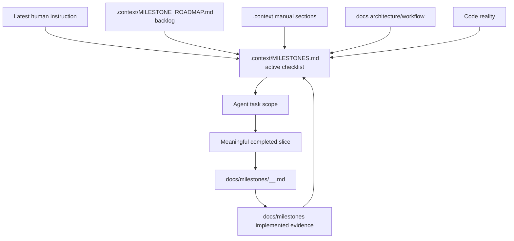

# Milestone Source Protocol

Milestone: `V1 - Governance And Milestone Workflow`

## Workflow



## What Changed

Context-gen now follows the milestone working model proven in `ZeroClaw-Vbee-Automate`:

- `.context/MILESTONES.md` is the active milestone pointer and checklist.
- `.context/MILESTONE_ROADMAP.md` is the detailed backlog.
- Agents promote one future milestone at a time.
- Implemented work is recorded in `docs/milestones/`.
- `docs/README.md` indexes docs and milestone evidence.

## Files Changed Or Added

```text
.context/MILESTONES.md
.context/MILESTONE_ROADMAP.md
AGENTS.md
docs/README.md
docs/tension-register-milestone-workflow.md
docs/milestones/V1_001_milestone-source-protocol.md
```

## Design Pattern

The adopted pattern separates three kinds of milestone knowledge:

```text
active checklist  -> .context/MILESTONES.md
future backlog    -> .context/MILESTONE_ROADMAP.md
implemented proof -> docs/milestones/*.md
```

This prevents agents from loading or implementing multiple future milestones at once.

## Verification

Run:

```bash
python cli.py check-consistency .
```

Expected result after this slice:

```text
No missing .context/MILESTONES.md warning.
No V0 active tension archive-candidate warning after human-approved archival.
```

## Known Limits

- This slice archives old `TENSIONS_ACTIVE.md` entries only after human approval.
- This slice does not implement parser behavior.
- Human approval is still required before milestone promotion or tension archival.
