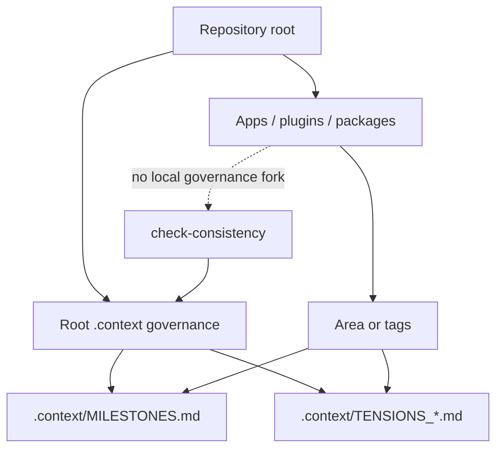

# Program Governance Root

Milestone: `V1 - Governance And Milestone Workflow`

## Workflow



## What Changed

Context-gen now documents and checks the rule that monorepos use one governance root. Subprojects are scoped with `Area:` or tags instead of creating local milestone or tension systems.

## Files Changed Or Added

```text
consistency.py
test_consistency.py
.context/MILESTONES.md
docs/tension-register-milestone-workflow.md
docs/prompts/01_init-project-with-context-mapping.md
docs/milestones/V1_002_program-governance-root.md
docs/README.md
```

## Design Pattern

The pattern separates governance authority from code ownership:

```text
root .context/MILESTONES.md  -> program roadmap authority
root .context/TENSIONS_*.md  -> program decision/conflict log
subproject Area/tags         -> scope and filtering
subproject README checklist  -> implementation details only
```

This prevents an agent working from a subfolder from accidentally creating a competing roadmap.

## Verification

Run:

```bash
python -m unittest test_consistency.py
python cli.py check-consistency .
python cli.py build . --quiet
```

Expected result:

```text
Nested .context/MILESTONES.md is an error.
Nested .context/TENSIONS_*.md is an error.
Nested non-context MILESTONES.md is a warning.
Root governance files remain the source of truth.
```

## Known Limits

- The check cannot know whether a nested directory is intentionally becoming a separate repository; human approval is still required for governance splits.
- The check warns on plain nested `MILESTONES.md` files instead of failing because some teams may use them as local implementation checklists.
