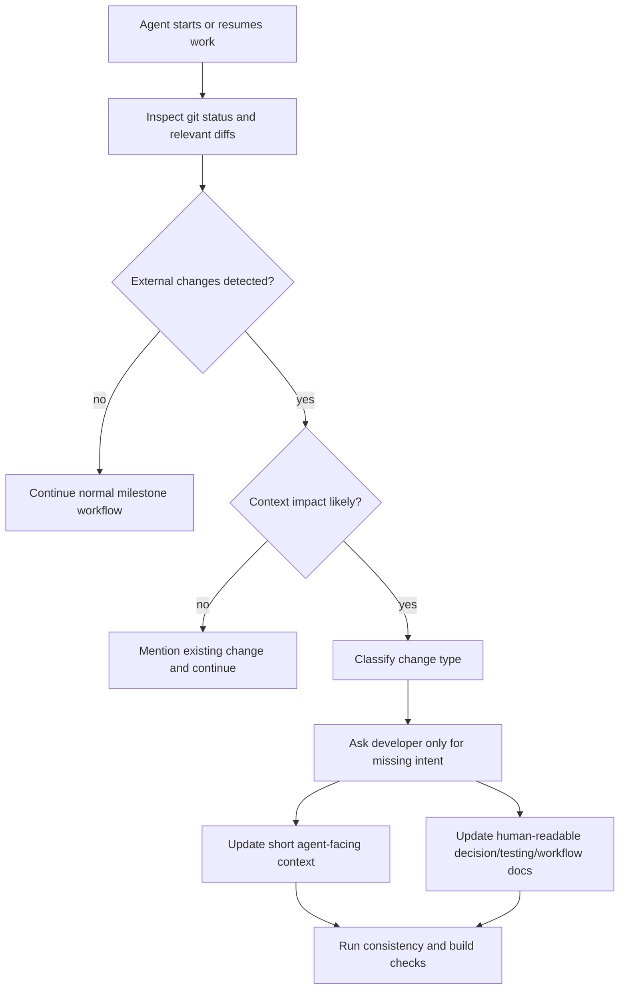

# Out-of-Band Change Intake

Milestone: `V1 - Governance And Milestone Workflow`

## Workflow



## What Changed

The governance workflow now covers code or artifact fixes made outside the active agent workflow. These changes can leave context debt: humans know why a fix happened, but future agents only see stale context. The new intake rule makes agents reconcile external changes before continuing when the diff changes assumptions, module contracts, milestone scope, or workflow behavior.

## Files Changed Or Added

```text
.context/GLOBAL.md
.context/MILESTONES.md
AGENTS.md
docs/tension-register-milestone-workflow.md
docs/prompts/01_init-project-with-context-mapping.md
docs/milestones/V1_003_out-of-band-change-intake.md
docs/README.md
```

## Design Pattern

The pattern separates two audiences:

```text
agent-facing context -> short operational rule in .context/
dev-facing docs      -> rationale, evidence, and trade-offs in docs/
```

The agent detects only signals such as changed paths and diffs. It asks the developer for missing intent instead of guessing why a hotfix, artifact repair, or direct edit happened outside the milestone workflow.

## Verification

Run:

```bash
python cli.py check-consistency .
python cli.py build . --quiet
```

Expected result:

```text
Milestone governance remains consistent.
Context files keep using the V3 tension split.
The new intake workflow is discoverable from docs and init prompts.
```

## Known Limits

- This slice documents the contract only; it does not implement a dedicated `context-gen intake` CLI command yet.
- The agent still cannot infer developer intent from code alone. The workflow requires asking the developer when intent is missing.
- Full automation should wait until the CLI can inspect diffs, map changed paths to context targets, and persist a structured reconciliation record.
